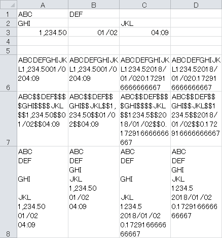

# JoinRangeText

## JoinRangeText
Join texts in selected range.

## JoinRangeTextA
Join not empty texts in selected range.

## JoinRangeValue
Join values in selected range.

## JoinRangeValueA
Join not empty values in selected range.

## Sample
| A | B | C | D |
| ---- | ---- | ---- | ---- |
| =JoinRangeText($A$1:$C$3) | =JoinRangeTextA($A$1:$C$3) | =JoinRangeValue($A$1:$C$3) | =JoinRangeValueA($A$1:$C$3) |
| =JoinRangeText($A$1:$C$3, "$$") | =JoinRangeTextA($A$1:$C$3, "$$") | =JoinRangeValue($A$1:$C$3, "$$") | =JoinRangeValueA($A$1:$C$3, "$$") |
| =JoinRangeText($A$1:$C$3, CHAR(10)) | =JoinRangeTextA($A$1:$C$3, CHAR(10)) | =JoinRangeValue($A$1:$C$3, CHAR(10)) | =JoinRangeValueA($A$1:$C$3, CHAR(10)) |

(Align:Top, Text Wrap:On)

## Link
- [セル範囲を指定して文字列を結合・連結するユーザー定義関数:エクセルマクロ・Excel VBAの使い方-ユーザー定義関数](http://www.relief.jp/docs/001342.html)
- [Join Function](https://msdn.microsoft.com/en-us/vba/language-reference-vba/articles/join-function)
- [Join 関数](https://msdn.microsoft.com/ja-jp/library/cc410253.aspx)
